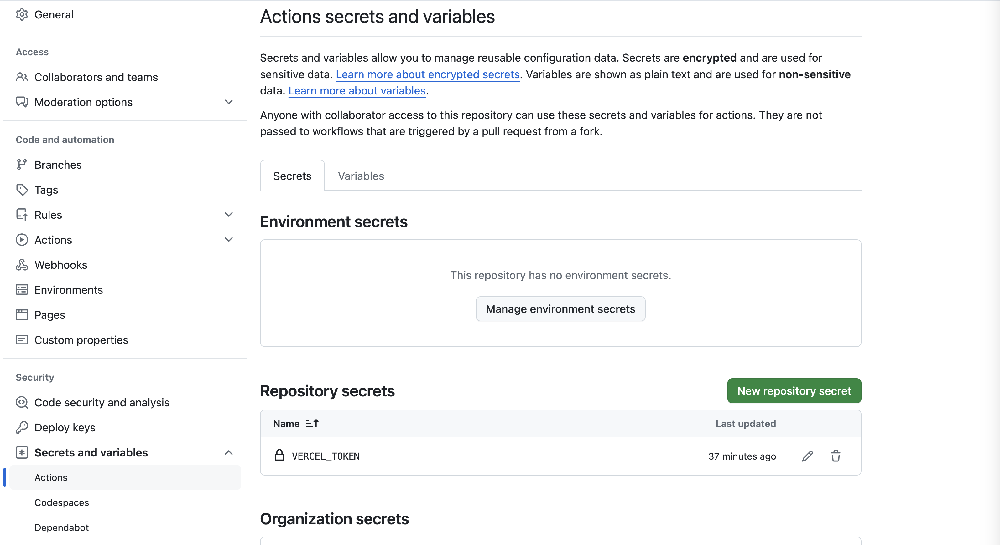

# Lab 5: Continuous delivery - Step 3: Deploying the app

The goal of this lab is to show you how you could automate the deployment of the app to a specific environment, e.g. staging or production.

> Note: this lab builds upon the results of the previous labs

## Adding a deployment stage to our continuous delivery pipeline

In previous stages of the pipeline we make sure the latest changes were integrated, the test were passing and the application is built and packaged. That gives us enough confidence that we can deploy the latest version of the application to an environment.

Think about it, when do the latest code changes start delivering value? Is it when they are tested and the application is built or is it when they are deployed and released to the end users?

This stage of the pipeline is a bit more complicated. So far we were running commands only in the Github Actions worker machines. To automate a deployment we need to trigger an action in an external service, the one providing the deployment environment. We need to authenticate with the service where we will deploy our app.

For the scope of this tutorial, we will use Vercel. You can think of Vercel like a free server where you can expose your app to real users. If you don't have a Vercel account, it is fine! No worries. You can go for option 1 in this lab where we simulate a deployment.

> "Deploy the same way to every environment—including development. This way, we test the deployment process many, many times before it gets to production, and again, we can eliminate it as the source of any problems." -- by [continuousdelivery.com](https://continuousdelivery.com/implementing/patterns/)

## Let's perform a real deployment using Vercel

Let's first try it locally:

1. Install vercel using `npm i -g vercel`
2. Run `vercel` to set up the environment
3. Run `vercel --prod` to push to production the latest version of the application


Lets add a new job that allow us to deploy our modern web app to an environment that we will call production.

We have to create a Token so GitHub impersonate our personal Vercel account through the Vercel API.
First we will create a token in Vercel going to `Account Settings > Tokens > Create Token`


Then we will add this secret into GitHub actions, <code style="color : red">  IMPORTANT: never commit secrets in your repository</code>

`Secrets and variables > Actions > Actions secrets > New secret`



Now we can add the following infra as code in our pipeline:

```yaml
jobs:
    [...]
    deploy-prod:
        name: Deploy to prod
        needs: check-performance
        runs-on: ubuntu-latest
        if: github.ref == 'refs/heads/main'

        steps:
            - name: Checkout code
              uses: actions/checkout@v2
            - name: Deploy with Node.js ${{ env.NODE_VERSION }}
              uses: actions/setup-node@v1
              with:
                  node-version: ${{ env.NODE_VERSION }}
            - name: Deploy to prod environment
              run: |
                npm i -g vercel
                vercel --token "$VERCEL_TOKEN" --prod
              env:
                VERCEL_TOKEN: ${{ secrets.VERCEL_TOKEN }}
```

## Useful Theory

[What are the differences between continuous integration vs. delivery vs. deployment?](https://www.atlassian.com/continuous-delivery/principles/continuous-integration-vs-delivery-vs-deployment)

## Lab checklist

- [ ] Read the instructions
- [ ] Add the deploy:simulate tasks in the NPM scripts declaration
- [ ] Add the automated deployment job to the CD pipeline
- [ ] Push the changes and check the pipeline logs in the Actions tab
- [ ] Answer this question: Is the pipeline implementing continuous delivery or continuous deployment?
